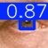

Eye Segmentation
Eye Segmentation is a project for automatic eye detection and analysis in images using state-of-the-art computer vision methods.
The project implements a complete pipeline: from data preparation and model training to inference and result saving. The main framework used is Ultralytics YOLOv8, which enables fast and efficient object detection model training and inference. Configuration management is handled via Hydra and OmegaConf for flexible and reproducible experiments. MLflow is integrated for experiment tracking and logging of training metrics and artifacts.
Initially, the project attempted to implement a custom architecture and loss functions using PyTorch and torchmetrics, but due to limited computational resources, full training from scratch was not feasible. As a result, a transfer learning approach was adopted using a pre-trained YOLOv8 model, which allowed for high accuracy in eye detection and classification tasks (e.g., cataract detection).
Key libraries and frameworks used:
Ultralytics YOLOv8 — object detection framework
PyTorch — deep learning library
Hydra & OmegaConf — configuration management
MLflow — experiment tracking and logging
torchmetrics — evaluation metrics
NumPy — numerical computations
OpenCV — image processing (used optionally)
Project features:
Automatic search and loading of the best available model (custom-trained, checkpoint, or standard YOLOv8n)
Batch processing of images from test or validation datasets
Saving detection results (annotated images, label files) in a structured format
Logging of process and summary statistics
MLflow integration for experiment tracking
This project can be easily adapted for custom eye detection tasks or similar medical computer vision applications.

